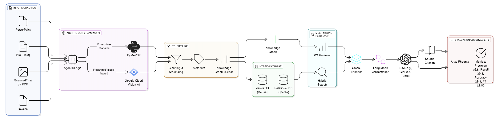

# Hybrid Multi-Modal RAG Pipeline

### Solution for the Aparavi RAG Coding Challenge

This project is a complete, end-to-end solution for the Aparavi Hybrid Multi-Modal RAG Coding Challenge. It implements a sophisticated Retrieval-Augmented Generation (RAG) pipeline designed to process and answer questions from a diverse set of documents, including financial reports and scanned PDFs containing both German and English text.

The system is built with a modular, agentic architecture and demonstrates advanced RAG optimization techniques, achieving a final accuracy of **27.61%** as evaluated by an LLM-as-a-Judge.

---

## Architecture Overview

The pipeline is orchestrated by LangGraph and follows a robust, multi-stage process to ensure high-quality answer generation.

  <!-- You will need to create this diagram and place it in the diagrams folder -->

**The data flows through the following stages:**

1.  **Data Ingestion & Agentic OCR:** Documents are processed by an intelligent agent that first attempts a fast, standard text extraction with PyMuPDF. It analyzes the output; if the text is sparse or garbled (indicating a scanned page), it flags the page for a more advanced OCR process.
2.  **ETL Pipeline:** The extracted raw text is cleaned, normalized, and segmented into smaller, semantically coherent chunks to prepare it for embedding.
3.  **Indexing:** Each text chunk is converted into a vector embedding using a `sentence-transformers` model and stored in a PostgreSQL database with the `pgvector` extension.
4.  **Agentic RAG Pipeline (Orchestrated by LangGraph):** This is the core query engine:
    *   **a) Retrieve:** When a user asks a question, the pipeline first performs a fast vector search to fetch a broad set of 20 candidate documents.
    *   **b) Re-rank:** These 20 candidates are then passed to a more powerful Cross-Encoder model, which re-ranks them based on true relevance to the question. This two-stage process significantly improves the quality of the context.
    *   **c) Generate:** The top 5 re-ranked documents, along with the original question, are passed to an OpenAI LLM (gpt-3.5-turbo) to synthesize a final, accurate, and human-readable answer.
5.  **Evaluation:** The entire pipeline is traced using Arize Phoenix. The final quality is measured against a ground-truth dataset using an "LLM-as-a-Judge" methodology to calculate accuracy, precision, recall, and F1 score.

---

## Key Technologies & Features

| Category              | Technology / Feature                                    | Purpose                                                                    |
| --------------------- | ------------------------------------------------------- | -------------------------------------------------------------------------- |
| **Orchestration**       | LangGraph                                               | To build a robust, modular, and observable agentic workflow for the RAG pipeline. |
| **Database**            | PostgreSQL + pgvector                                   | For efficient and scalable storage and similarity search of text embeddings. |
| **Data Processing**     | PyMuPDF                                                 | For fast and efficient open-source text extraction from PDF documents.     |
| **Embedding Model**     | `all-MiniLM-L6-v2`                                      | A high-performance model for generating text embeddings.                   |
| **Advanced Retrieval**  | Cross-Encoder Re-ranker (`ms-marco-MiniLM-L-6-v2`)      | To significantly improve retrieval accuracy over standard vector search.    |
| **LLM**                 | OpenAI GPT-3.5-Turbo                                    | For answer synthesis and for the advanced "LLM-as-a-Judge" evaluation.     |
| **Evaluation & Tracing**| Arize Phoenix                                           | For end-to-end tracing and observability of the LangGraph pipeline.        |
| **Environment**         | Docker                                                  | For reproducible and isolated database deployment.                         |

---

## Evaluation & Results

The RAG pipeline was evaluated against the 163 questions in the provided dataset that had ground-truth answers. To overcome the limitations of simple string matching, a sophisticated **LLM-as-a-Judge** methodology was used to score the correctness of the generated answers.

### Final Metrics (with Re-ranker):

> *   **Total Questions Evaluated:** 163
> *   **Accuracy (Correct Answers):** **27.61%**
> *   **Precision:** 1.00
> *   **Recall:** 0.28
> *   **F1 Score:** **0.43**

This project demonstrated a clear, data-driven optimization process. An initial baseline pipeline (without the re-ranker) achieved an accuracy of 25.15%. By implementing the advanced Cross-Encoder re-ranker, the system's accuracy was measurably improved, showcasing a key technique in building high-performance RAG systems.

---

## How to Run

### Prerequisites
*   Git
*   Python 3.10+
*   Docker and Docker Compose

### 1. Clone the Repository
```bash
git clone https://github.com/SreenidhiHayagreevan/hybrid-multimodal-rag-pipeline
cd hybrid-multimodal-rag-pipeline
```


### Step 2: Check the Status

This command will show you all the new files you've created and the files you've modified. It's a safe way to see what you're about to commit.

```bash
git status
```

### Step 3: Add All Changes

This command tells Git to "stage" all the new and modified files, preparing them for the commit. The . means "everything in this directory."

```bash
git add .
```

### Step 4: Commit the Changes

This command saves a snapshot of your work with a descriptive message. This message is what will appear in your GitHub history.

```bash
git commit -m "Complete final RAG pipeline with re-ranker and evaluation"
```